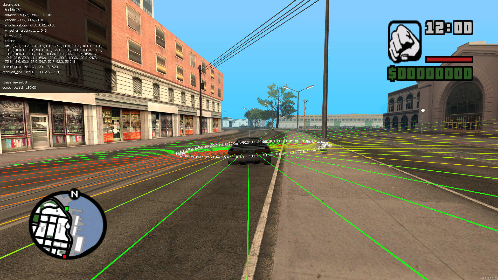
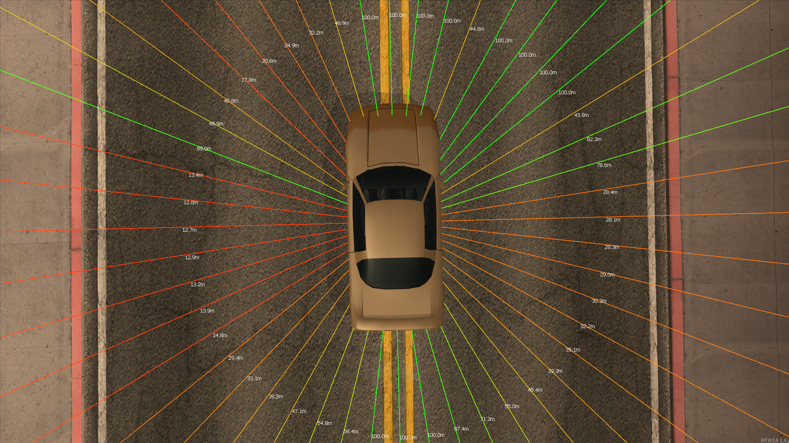
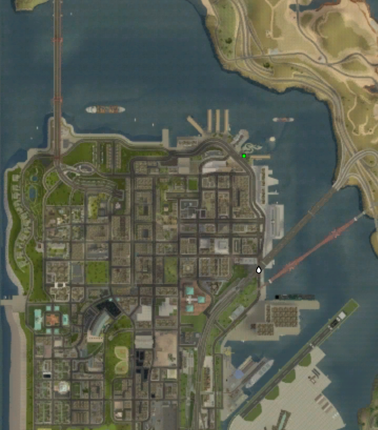
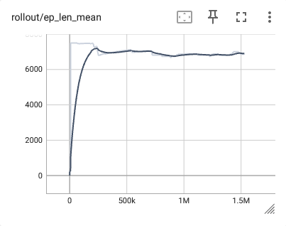
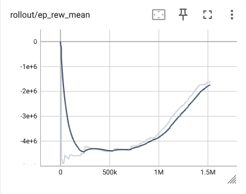
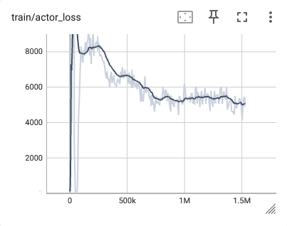
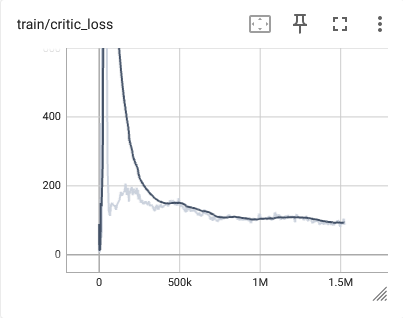

# Reinforcement Learning in Multi Theft Auto: San Andreas
This project is a reinforcement learning environment for the game Multi Theft Auto: San Andreas. The environment is built using the (Robotics) Gymnasium framework. The game is a multiplayer modification for Grand Theft Auto: San Andreas with added support for scripting. MTA:SA does not have any traffic or pedestrian roaming in the world other than real players. The environment is designed to be used with reinforcement learning algorithms to train agents to play the game.

Specifically, the environment can be used to control a pedestrian in the game. In the given example below, the pedestrian is controlling a car and is trying to reach a specific location on the map. The environment is designed to be flexible and can be used to train agents to perform various tasks in the game.



## Installation
### MTA:SA Client
To install the environment, you need to have the game Multi Theft Auto: San Andreas installed. You can download the game from the [official website](https://multitheftauto.com/) (nightly build is available [here](https://nightly.multitheftauto.com/)). Detailed instructions on how to install the game can be found in the [official wiki](https://wiki.multitheftauto.com/wiki/Client_Manual#Installing_the_game). If you are using Linux, you can use [this guide](https://wiki.multitheftauto.com/wiki/Client_on_Linux_using_Lutris_Manual) to install the game.

Before you can install MTA, you need to have the game Grand Theft Auto: San Andreas installed without any modifications. You can buy the game officially from [Rockstar Games](https://store.rockstargames.com/en/game/buy-grand-theft-auto-the-trilogy). For more information on buying the game, you can visit the MTA's wiki [Where to buy GTASA](https://wiki.multitheftauto.com/wiki/Where_to_buy_GTASA).

Make sure to disable the option "device selection" in the game's settings. This option can be found in the game's settings under the "Display" tab. If you do not disable this option, the game will not be able to automatically select the correct device and will not be able to run in the background.

### MTA:SA Server
After you have installed the game, you also need to install the MTA:SA server. In this repository, you can find a docker-compose file to run the server in a docker container. It includes all basic config and resources to get started. You can find the docker files in the `server` directory. To run the server, you need to have Docker installed. Alternatively, you can install the server manually. You can find the instructions on how to install the server in the [official wiki](https://wiki.multitheftauto.com/wiki/Server_Manual#Installing_the_server).

#### Admin account
For the environment, it is necessary to add at least one administrator to your server in order to reset the environment. This administrator will then also be able to log in from within the game and control the server.
To add an administrator to your server, follow these steps:
1. While the server is running, add a new account by typing **addaccount name password** into the server window. For example, to add user Chainik you could type:
```
addaccount Chainik 123456
```
2. The server should display a message confirming the account has been added.
3. Next, shutdown the server by typing shutdown into the server window.
4. Make sure your server is stopped; if your server is still running, the following changes you make will be overwritten
5. Open the file 'mods/deathmatch/acl.xml' with any text editor
6. Add the account to the Admin group by using the XML-syntax below
```xml
<acl>
  ...
  <group name="Admin">
    <acl name="Admin"/>
    ...
    <object name="user.Chainik" />
  </group>
  ...
</acl>
```
You're done adding an administrator to your server. You can now start the server again.

### Environment
The environment is built using the Gymnasium framework. It is designed to be used with reinforcement learning algorithms to train agents to play the game. To install the environment, you need to copy the directory `fhs_rl*` to the server in the directory `mods/deathmatch/resources`.

The following environment variables can be used to configure the environment:
- `MTA_SERVER_HOST`: the IP address of the MTA:SA server (e.g., 127.0.0.1)
- `MTA_SERVER_PORT`: the HTTP port of the MTA:SA server (e.g., 22005)
- `MTA_SERVER_ADMIN_USERNAME`: the username of the MTA:SA server admin (e.g., Chainik)
- `MTA_SERVER_ADMIN_PASSWORD`: the password of the MTA:SA server admin (e.g., 123456)

### Python
#### Docker
To install the environment, you need to have Docker installed. After installing Docker, you can run the environment using the provided docker-compose file. The docker-compose file contains all the necessary libraries and dependencies to run the environment. You can run the environment by executing the following command:
```bash
cd agent-sb3
docker compose build
docker compose up
```

#### Manual
To install the environment, you need to have Python 3.11 or later installed. To bridge the communication between the game and the environment, you need to install `fastapi`, `pydantic`, `uvicorn`, and `requests`. You can install these packages using pip:
```bash
pip install fastapi pydantic uvicorn requests
```

For the reinforcement learning part, you need to install the `gymnasium` package. You can install it using pip:
```bash
pip install gymnasium
```

In the given example, we use the libraries `stable-baselines3` and `sbx` to train the agent. You can install these packages using pip:
```bash
pip install stable-baselines3 sbx
```
I have made a fork of the `sbx` library to add support for MultiInputPolicy in DroQ. You can install it using pip:
```bash
pip install git+https://github.com/Chaiinik/sbx
```

## Usage Example

1. First, you need to start the MTA:SA server. Make sure to copy the resources to the server after starting it.
```bash
cd mtasa-server
docker compose build
docker compose up -d
```

2. After the server is running, you can start the game and connect to the server. You can find the server in the server browser in the tab "Local". Alternatively, you can pass the following arguments to the game's executable to connect to the server:
```
mtasa://agent@127.0.0.1:22003
```

3. Rename your nick to "agent" in the game. This is needed to identify the agent in the environment. Press `F8` to open the console and type the following command (This is only needed once, the game will remember the nick after you have set it once):
```
nick agent
```

4. After you have connected to the server, you can start the environment. Type the following commands in the game's console to start the environment:
```bash
login Chainik 123456
start fhs_rl_goal
```

5. Enable debugscript to see the environment's output. Type the following command in the game's console to enable the debugscript:
```bash
debugscript 3
```

6. After the environment is started, you can start the training of the agent. You can find an example of how to train the agent in the file `train.py`. You can run the training using the following command:
```bash
cd agent-sb3
docker compose up
```

## Environments
All environments communicate via HTTP with the game. The environment sends a signal to reset to the MTA:SA server. The server stops the current episode, which sends an event to the client. The client responds after the episode has been stopped. Afterwards, the server starts the new episode and signals the client. The client responds to the server once it is ready. Then the game client starts sending observations to an endpoint, and the environment replies with the action to be performed.


### fhs_rl_goal
This environment is based on the GoalEnv ([robotics environment](https://robotics.farama.org/)) and can be used with the [Hindsight Experience Replay](https://arxiv.org/abs/1707.01495) (HER) algorithm. It can be used with the example agent in `main-sbx-goal.py` to train the agent using the [Dropout Q-Functions for Doubly Efficient Reinforcement Learning](https://arxiv.org/abs/2110.02034) (DroQ) algorithm.

#### Action
The action space is a `Box(-1.0, 1.0, (2,), float32)` and consists of two continuous actions:

| Name | Action | Min | Max |
| --- | --- | --- | --- |
| steering | float | -1 | 1 |
| acceleration | float | -1 | 1 |

#### Observation
The observation is a goal-aware observation space. It consists of a dictionary with information about the vehicle and the goal. The observation space is a Dict with the following keys:

- `observation`: its value is an ndarray of shape `(64,)`. It consists of the following observations:

| Name | Min | Max |
| --- | --- | --- |
| vehicle health | 0 | 1000 |
| vehicle velocity (x,y,z) | -100 | 100 |
| vehicle rotation (x,y,z) | -180 | 180 |
| vehicle angular velocity (x,y,z) | -100 | 100 |
| vehicle wheel on ground (4x) | 0 | 1 |
| vehicle in water | 0 | 1 |
| vehicle collision | 0 | 100 |
| lidar (48x) | 0 | 100 |

- `desired_goal`: this key represents the final goal to be achieved. In this environment it is a 3-dimensional `ndarray`, `(3,)`, that consists of the three cartesian coordinates of the desired final vehicle position [x,y,z]. The elements of the array are the following:

| Name | Observation | Min | Max |
| --- | --- | --- | --- |
| final goal vehicle position in the x coordinate | -3000 | 3000 |
| final goal vehicle position in the y coordinate | -3000 | 3000 |
| final goal vehicle position in the z coordinate | -3000 | 3000 |

- `achieved_goal`: This key represents the current state of the vehicle, as if it had achieved a goal. This is useful for goal-oriented learning algorithms such as those that use [Hindsight Experience Replay](https://arxiv.org/abs/1707.01495) (HER). The value is an `ndarray` with shape `(3,)`. The elements of the array are as follows:

| Name | Min | Max |
| --- | --- | --- |
| current vehicle position in the x coordinate | -3000 | 3000 |
| current vehicle position in the y coordinate | -3000 | 3000 |
| current vehicle position in the z coordinate | -3000 | 3000 |

Below is a visualization of the lidar-like observation. The lidar is a 360-degree sensor with 48 rays. The rays are evenly distributed in the 360-degree field of view. The lidar returns the distance to the first object it encounters in the direction of the ray.


#### Rewards
The reward can be initialized as sparse or dense:
- `sparse`: the returned reward can have two values: 0 if the vehicle hasn't reached its final target position, and 1 if the vehicle is in the final target position (the vehicle is considered to have reached the goal if the Euclidean distance between both is lower than 1 m).
- `dense`: the returned reward is the negative Euclidean distance between the achieved goal position and the desired goal.

#### Starting State
When the environment is reset the vehicle is placed at the same starting position. The starting position is a in the following cartesian coordinates: `(x,y,z) = [-1558.98877, 655.05096, 7.2]`, and its orientation in degrees is `(x,y,z) = [0, 0, 0]`. It is marked with a red dot in the map. The current vehicle position is marked with a white droplet in the map.

The final goal position is aswell the same for every episode. The final goal position is a in the following cartesian coordinates: `(x,y,z) = [-1640.72437, 1288.37024, 7.2]`. It is marked with a green dot in the map.




#### Episode End
The episode will be terminated when the vehicle has reached the final goal position (the vehicle is considered to have reached the goal if the Euclidean distance between both is less than 1 m), if the vehicle is underwater, or if the vehicle health is 0.

### fhs_rl
TBD

#### Action
| Name | Action | Min | Max |
| --- | --- | --- | --- |
| steering | float | -1 | 1 |
| acceleration | float | -1 | 1 |
| handbrake | int | 0 | 1 |

#### Observation
| Name | Observation | Min | Max |
| --- | --- | --- | --- |
| vehicle health | float | 0 | 1000 |
| vehicle position | 3x float | -3000 | 3000 |
| vehicle velocity | 3x float | -100 | 100 |
| destination position | 3x float | -3000 | 3000 |
| next waypoint position | 3x float | -3000 | 3000 |
| vehicle rotation | 3x float | -180 | 180 |
| vehicle angular velocity | 3x float | -100 | 100 |
| lidar | 25x float | 0 | 100 |

#### Reward
| Name | Reward |
| --- | --- |
| vehicle collision | -1 |
| vehicle explosion | -100 |

### fhs_rl_rel
TBD

### fhs_rl-ray
_This environment is implemented using the [Ray RLlib](https://docs.ray.io/en/latest/rllib/index.html). It is discontinued due to performance issues._

## Benchmark of environment `fhs_rl_goal` using DroQ and HER

The agent was trained for 1.5 million time steps (approximately 16 hours) on a single NVIDIA RTX A4000 in the environment `fhs_rl_goal`. The training was done using the DroQ algorithm and HER replay buffer. The agent was trained using the dense reward signal. The training is done using the script `main-sbx-goal.py` in the `agent-sb3` directory and was done using the `sbx` library, which is a fork of the `stable-baselines3` library with support for the DroQ algorithm.

In the plots below, the mean episode length and mean episode reward are visualized. The mean episode length is the number of time steps the agent was able to drive before was truncated by the environment or reached its destination. The mean episode reward is the mean reward the agent received. Both metrics are averaged over the last 100 episodes.




In the plots below, the actor and critic loss are shown. The actor loss is the loss of the actor network and the critic loss is the loss of the critic network. The actor chooses the actions and the critic evaluates the actions.





The table below shows the results of the evaluation of the trained agent. The agent was evaluated 10 times in the environment `fhs_rl_goal` using the dense reward signal. The evaluation was done using the script `evaluate-sbx-goal-eval.py`. The agent was not able to reach the goal in any of the episodes. The agent was able to drive for an average of 29.5 seconds and 735 steps before the episode was truncated by the environment. The agent received an average reward of -173579.2.

| Episode | Time needed | Steps | Reward |
| --- | --- | --- | --- |
| 1 | 30 s | 750 | -160700.5 |
| 2 | 30 s | 750 | -166030.2 |
| 3 | 30 s | 750 | -163404.9 |
| 4 | 30 s | 750 | -165283.4 |
| 5 | 24 s | 600 | -175295.3 |
| 6 | 30 s | 750 | -167911.5 |
| 7 | 30 s | 750 | -167954.9 |
| 8 | 30 s | 750 | -169955.1 |
| 9 | 30 s | 750 | -175332.2 |
| 10 | 30 s | 750 | -223923.6 |

| Metric | Value |
| --- | --- |
| Average time needed | 29.5 +- 1.8 |
| Average steps | 735 +- 45 |
| Average rewards | -173579.2 +- 17357 |


## Limitations
- The environments are not designed for multi-agent training or vectorized environments. Although the environment can be extended to run multiple agents, it is not implemented yet.
- The game must be running in the background to communicate with the environment and must be started manually before training.

## References
- [Repository of the project](https://github.com/Chaiinik/mtasa-gym) - The repository of the project. It contains the environment and the training script
- [Multi Theft Auto: San Andreas](https://multitheftauto.com/) - The game used to create the environment
- [Gymnasium](https://github.com/Farama-Foundation/Gymnasium) - The environment used as a base for the environment
- [Gymnasium-Robotics](https://github.com/Farama-Foundation/Gymnasium-Robotics) - The environment used as a base for the environment
- [Stable Baselines3](https://github.com/DLR-RM/stable-baselines3) - The library used to train the agent
- [Stable Baselines Jax](https://github.com/araffin/sbx) - The library used to train the agent
- [lua_utils](https://github.com/sbx320/lua_utils) - Utilities library for Lua (the scripting language used in MTA:SA)
- [mtasa-resources/gps](https://github.com/multitheftauto/mtasa-resources/blob/master/[gameplay]/gps/) - GPS resource for MTA:SA used for finding a path from the current position to the destination
